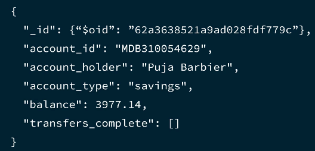
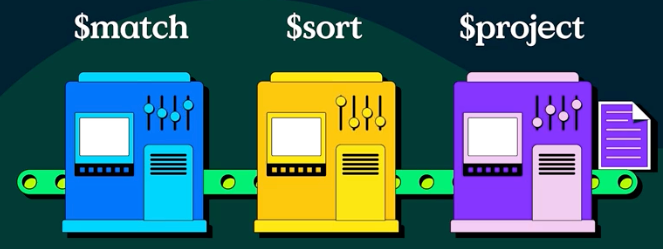

# Building a MongoDB Aggregation Pipeline in Java Applications

## Aggregation framework 
- An aggregation pipeline is composed of stages an expression operations
- Include these stages
  - Finding
  - Sorting
  - Grouping
  - Projecting
- Easy to debug and maintain individual stages
- Rewrite and optimize the query
- Stages can use expression operators
  - Expression operators are similar to functions

## Quiz 1
**What is the aggregation framework used for? (Select one.)**

a. To process documents and return computed results.

Correct! Aggregation operations process documents and return computed results. 
When working with data in MongoDB, you may have to run complex operations with multiple stages to quickly gather metrics for your project. 
Generating reports and displaying useful metadata are just two major use cases where MongoDB aggregation operations are incredibly useful, powerful, and flexible.

## Quiz 2
**Which component(s) of an aggregation pipeline do documents pass through for processing in sequence? (Select one.)**

a. Aggregation stages
Correct! An aggregation pipeline consists of one or more stages that process documents. 
Each stage performs an operation on the input documents. 
For example, a stage can filter documents, group documents, or calculate values.

## Using MongoDB Aggregation Stages with Java: `$match` and `$group`

## `$match`
- Filters documents to pass only the documents that match the specified conditions to the next stage of the pipeline.

## `$group`
- Separates documents into groups according to a group key. The output is one document for each unique group key.

## Example:


- Finds an account belonging to Puja Barbier, given an account number.

```java
public static void main(String[] args) {
    String connectionString = System.getProperty("mongodb.uri");
    try (MongoClient mongoClient = MongoClients.create(connectionString)) {
        MongoDatabase db = mongoClient.getDatabase("bank");
        MongoCollection<Document> accounts = db.getCollection("accounts");
        matchStage(accounts);
    }
}

private static void matchStage(MongoCollection<Document> accounts) {
    Bson matchStage = Aggregates.match(Filters.eq("account_id", "MDB310054629"));
    System.out.println("Display aggregation results");
    accounts.aggregate(Arrays.asList(matchStage)).forEach(document->System.out.print(document.toJson()));
}
```

- Finds the average balance and the total balance for the savings and checking accounts.

```java
public static void main(String[] args) {
    String connectionString = System.getProperty("mongodb.uri");
    try (MongoClient mongoClient = MongoClients.create(connectionString)) {
        MongoDatabase db = mongoClient.getDatabase("bank");
        MongoCollection<Document> accounts = db.getCollection("accounts");
        matchAndGroupStages(accounts);
    }
}

private static void matchAndGroupStages(MongoCollection<Document> accounts){
    Bson matchStage = Aggregates.match(Filters.eq("account_id", "MDB310054629"));
    Bson groupStage = Aggregates.group("$account_type", sum("total_balance", "$balance"), avg("average_balance", "$balance"));
    System.out.println("Display aggregation results");
    accounts.aggregate(Arrays.asList(matchStage, groupStage)).forEach(document->System.out.print(document.toJson()));
}

```

## Practice 1

In this activity, you will use the MongoDB Driver for Java to summarize data. Specifically, you will use aggregation to calculate the total and average balance of checking and savings accounts with balances of less than $1000.

Lab Instructions
1. Open the `Aggregation.java` file in the IDE by clicking the file name in the file explorer to the left.
2. Locate the `showAccountTypeSummary` method section and use the `pipeline` variable to create an array of aggregation operations that will be used to calculate the average balance of checking and savings accounts with balances of less than $1000. 
Your pipeline should include both the `match` and `group` operators.
3. Navigate to the `DemoApp.java` tab above and open the `DemoApp.java` file in the IDE by clicking the file name in the file explorer to the left. 
The rest of the code is provided and gets run in the `DemoApp.java` file. 
This line of code at the end will run the pipeline and display the results.
```java
agg.showAccountTypeSummary(pipeline);
```

```java
public class Aggregation {
    private final MongoCollection<Document> collection;

    public Aggregation(MongoClient client) {
        this.collection = client.getDatabase("bank").getCollection("accounts");
    }

    public void showAccountTypeSummary(MongoCollection<Document> accounts) {
        Bson matchStage = Aggregates.match(lt("balance", 1000));
        Bson groupStage = Aggregates.group("$account_type",
            sum("total_balance", "$balance"),
            avg("average_balance", "$balance"));
        System.out.println("Display aggregation results");
        accounts.aggregate(Arrays.asList(matchStage, groupStage))
            .forEach(document->System.out.print(document.toJson()));
    }
    
}
```

```java
public class DemoApp {
    public static void main(final String[] args) {
        Logger root = (Logger) LoggerFactory.getLogger("org.mongodb.driver");
        // Available levels are: OFF, ERROR, WARN, INFO, DEBUG, TRACE, ALL
        root.setLevel(Level.WARN);

        String connectionString = System.getenv("MONGODB_URI");
        try (MongoClient client = MongoClients.create(connectionString)) {
            MongoDatabase db = client.getDatabase("bank");
            MongoCollection<Document> accounts = db.getCollection("accounts");
            //Aggregation
            Aggregation agg = new Aggregation(client);
            agg.showAccountTypeSummary(accounts);
        }
    }
}
```

```json lines
Display aggregation results
{
  "_id": "checking", 
  "total_balance": {
    "$numberDecimal": "1133.810000000000"
  }, 
  "average_balance": {
    "$numberDecimal": "377.9366666666666666666666666666667"
  }
}
{
  "_id": "savings", 
  "total_balance": {
    "$numberDecimal": "2015.3800000000000"
  }, 
  "average_balance": {
    "$numberDecimal": "503.8450000000000"
  }
}
```

## Quiz 1

**Which of the following aggregation pipeline stages can be used to group data based on a key? (Select one.)**

b. .Group
Correct! The `.Group` stage is used to group documents based on a specified group key.

## Quiz 2
**Which of the following aggregation pipeline stages can be used to match data based on a specific condition? (Select one.)**

a. .Match
Correct! The `.Match` stage is used to match documents based on specified conditions.

## Using MongoDB Aggregation Stages with Java: `$sort` and `$project`

## `$sort`
- Sorts all input documents
- Sort in ascending order use 1
- Sort in descending order use -1

## `$project`
- Specifies output shape
- Projection similar to `find()` operations
- Should be used as the last stage to format the output

## Example:


- Find all checking accounts with a balance greater than 1500
- Sort the results in descending order
- Return only the original balance, Euro balance, account_type, and account_id fields

```java
public static void main(String[] args) {
    String connectionString = System.getProperty("mongodb.uri");
    try (MongoClient mongoClient = MongoClients.create(connectionString)) {
        MongoDatabase db = mongoClient.getDatabase("bank");
        MongoCollection<Document> accounts = db.getCollection("accounts");
        matchSortAndProjectStages(accounts);
    }
}

private static void matchSortAndProjectStages(MongoCollection<Document> accounts){
    Bson matchStage =
            Aggregates.match(Filters.and(Filters.gt("balance", 1500), Filters.eq("account_type", "checking")));
    Bson sortStage = Aggregates.sort(Sorts.orderBy(descending("balance")));
    Bson projectStage = Aggregates.project(Projections.fields(Projections.include("account_id", "account_type", "balance"), Projections.computed("euro_balance", new Document("$divide", asList("$balance", 1.20F))), Projections.excludeId()));
    System.out.println("Display aggregation results");
    accounts.aggregate(asList(matchStage,sortStage, projectStage)).forEach(document -> System.out.print(document.toJson()));
}
```

## Practice 1

In this activity, you will use the MongoDB Driver for Java to aggregate data. Specifically, you will use aggregation to return the British Pound (GBP) balance and account type of all checking accounts with balances less than $1500, in order from highest balance to lowest

Lab Instructions
1. Open the `Aggregation.java` file in the IDE by clicking the file name in the file explorer to the left. 
2. Locate the `showGBPBalancesForCheckingAccounts` method and use the `mspPipeline` variable to create an array of aggregation operations that will be used to calculate the GBP balance of checking accounts with balances of less than `$1500`. 
Your pipeline should include the `match`, `sort` and `project` operators.
```java
public void showGBPBalancesForCheckingAccounts(MongoCollection<Document> accounts) {
    Bson matchStage = null; //TODO define the match balance & account stage
    Bson sortStage = null; //TODO define the sort stage
    Bson projectStage = null; //TODO: define the projection stage

    System.out.println("Display aggregation results");
    accounts.aggregate(asList(matchStage,sortStage, projectStage)).forEach(document -> System.out.print(document.toJson()));
}
```
3. You will be responsible for only the pipeline variable in this activity. The rest of the code is provided and gets ran in the DemoApp.java file. This line of code at the end will run the pipeline and display the results.
```java
agg.showGBPBalancesForCheckingAccounts(accounts);
```
## Solution:
```java
public class Aggregation {
    private final MongoCollection<Document> collection;

    public Aggregation(MongoClient client) {
        this.collection = client.getDatabase("bank").getCollection("accounts");
    }

    public void showGBPBalancesForCheckingAccounts(MongoCollection<Document> accounts) {
        Bson matchStage = Aggregates.match(
            and(
                gt("balance", 1500),
                eq("account_type", "checking")
                )
        );
        Bson sortStage = Aggregates.sort(
            orderBy(descending("balance"))
        );
        Bson projectStage = Aggregates.project(
            fields(
                include("account_id", "account_type", "balance"),
                excludeId()
            )
        );
        System.out.println("Display aggregation results");
        accounts.aggregate(asList(matchStage,sortStage, projectStage)).forEach(document -> System.out.print(document.toJson()));
    }
    
}
```
```java
public class DemoApp {
    public static void main(final String[] args) {
        Logger root = (Logger) LoggerFactory.getLogger("org.mongodb.driver");
        // Available levels are: OFF, ERROR, WARN, INFO, DEBUG, TRACE, ALL
        root.setLevel(Level.WARN);

        String connectionString = System.getenv("MONGODB_URI");
        try (MongoClient client = MongoClients.create(connectionString)) {
            MongoDatabase db = client.getDatabase("bank");
            MongoCollection<Document> accounts = db.getCollection("accounts");
            //Aggregation
            Aggregation agg = new Aggregation(client);

            agg.showGBPBalancesForCheckingAccounts(accounts);
        }
    }
}
```
```json lines
Display aggregation results
{
  "account_id": "MDB727578791",
  "account_type": "checking",
  "balance": {
    "$numberDecimal": "4840.34000000000"
  }
}
{
  "account_id": "MDB267283685",
  "account_type": "checking",
  "balance": {
    "$numberDecimal": "4779.05000000000"
  }
}
{
  "account_id": "MDB786183140",
  "account_type": "checking",
  "balance": {
    "$numberDecimal": "4705.31000000000"
  }
}
{
  "account_id": "MDB574189300",
  "account_type": "checking",
  "balance": {
    "$numberDecimal": "4690.87000000000"
  }
}
{
  "account_id": "MDB333829449",
  "account_type": "checking",
  "balance": {
    "$numberDecimal": "4688"
  }
}
{
  "account_id": "MDB905411541",
  "account_type": "checking",
  "balance": {
    "$numberDecimal": "4575.96000000000"
  }
}
{
  "account_id": "MDB951086017",
  "account_type": "checking",
  "balance": {
    "$numberDecimal": "4508.21000000000"
  }
}
{
  "account_id": "MDB526002521",
  "account_type": "checking",
  "balance": {
    "$numberDecimal": "4271.84000000000"
  }
}
{
  "account_id": "MDB659507055",
  "account_type": "checking",
  "balance": {
    "$numberDecimal": "3887.53000000000"
  }
}
{
  "account_id": "MDB605641817",
  "account_type": "checking",
  "balance": {
    "$numberDecimal": "3858.66000000000"
  }
}
{
  "account_id": "MDB405111108",
  "account_type": "checking",
  "balance": {
    "$numberDecimal": "3655.17000000000"
  }
}
{
  "account_id": "MDB835466518",
  "account_type": "checking",
  "balance": {
    "$numberDecimal": "3467.69000000000"
  }
}
{
  "account_id": "MDB584129186",
  "account_type": "checking",
  "balance": {
    "$numberDecimal": "3453.76000000000"
  }
}
{
  "account_id": "MDB672307611",
  "account_type": "checking",
  "balance": {
    "$numberDecimal": "3435.86000000000"
  }
}{
  "account_id": "MDB829000996",
  "account_type": "checking",
  "balance": {
    "$numberDecimal": "3373.98000000000"
  }
}{
  "account_id": "MDB483602563",
  "account_type": "checking",
  "balance": {
    "$numberDecimal": "2855.94000000000"
  }
}{
  "account_id": "MDB269695119",
  "account_type": "checking",
  "balance": {
    "$numberDecimal": "2718.29000000000"
  }
}{
  "account_id": "MDB641809724",
  "account_type": "checking",
  "balance": {
    "$numberDecimal": "2718.24000000000"
  }
}{
  "account_id": "MDB963134500",
  "account_type": "checking",
  "balance": {
    "$numberDecimal": "2598.57000000000"
  }
}{
  "account_id": "MDB343652528",
  "account_type": "checking",
  "balance": {
    "$numberDecimal": "2522.14000000000"
  }
}{
  "account_id": "MDB565900210",
  "account_type": "checking",
  "balance": {
    "$numberDecimal": "2360.06000000000"
  }
}{
  "account_id": "MDB111454924",
  "account_type": "checking",
  "balance": {
    "$numberDecimal": "2088.32000000000"
  }
}{
  "account_id": "MDB600314692",
  "account_type": "checking",
  "balance": {
    "$numberDecimal": "2021.67000000000"
  }
}{
  "account_id": "MDB955769550",
  "account_type": "checking",
  "balance": {
    "$numberDecimal": "1971.89000000000"
  }
}{
  "account_id": "MDB870205338",
  "account_type": "checking",
  "balance": {
    "$numberDecimal": "1907.80000000000"
  }
}
```

## Quiz 1
**Which of the following aggregation pipeline stages is used to pass documents with the requested fields to the next stage in the pipeline? (Select one.)**

b. .Project
Correct! The `.Project` stage passes the documents with the requested fields to the next stage in the pipeline.

## Quiz 2
**Which of the following aggregation stages organizes the results of the pipeline in ascending or descending order? (Select one.)**

c. .Sort
Correct! The `.Sort` stage sorts all documents in the pipeline before returning them.