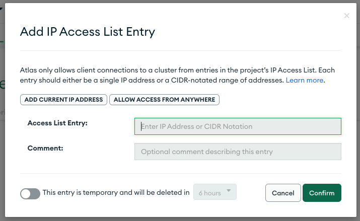
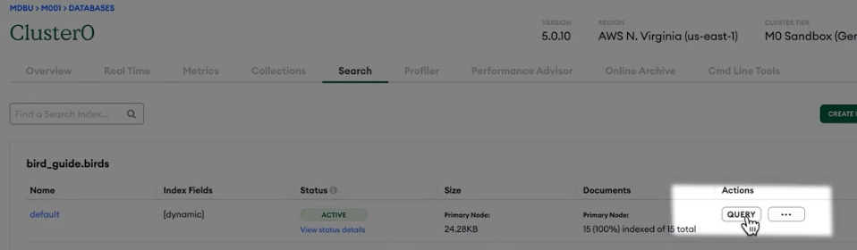
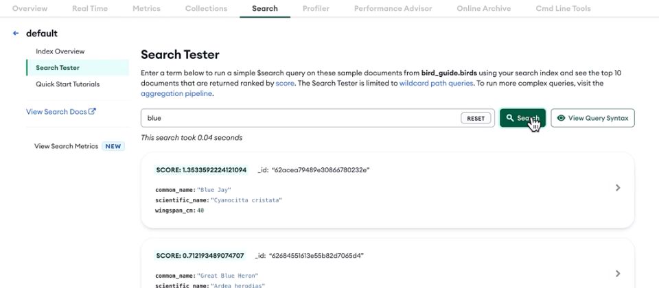
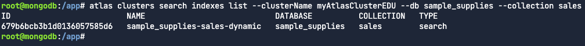
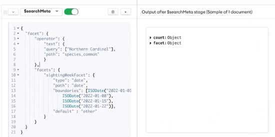

# MongoDB Indexes

## Lesson 1: Using MongoDB Indexes in Collections

### What indexes are

- Special data structures
- Store small portion of the data
- Ordered and easy to search efficiently
- Point to the document identity


### Costs of using indexes
#### Indexes improve query performance:
- Speed up queries
- Reduce disk I/O
- Reduce resources required
- Support equality matches and range-based operations and return sorted results

#### Without indexes
- MongoDB reads all documents (collection scan)
- Sorts results in memory

#### With indexes
- MongoDB only fetches the documents identified by the index based on the query
- Return results faster
- By default, there is one default index per collection, which includes only the _id field

1. Every query should use an index.
2. If we insert or update documents, we need to update the index data structure.
3. Write performance can degrade if we have too many indexes in a collection.
4. Delete unnecessary or redundant indexes.

### Most common index types
#### How indexes can improve performance
1. Single field
2. Compound
3. Both indexes are multikey indexes operate on an array field


Both queries can use this index

### Quiz 1

**Which of the following statements about indexes are correct? (Select all the that apply.)**

a. Indexes are data structures that improve performance, support efficient equality matches and range-based query operations, and can return sorted results
Indexes are data structures that improve performance, support efficient equality matches and range-based query operations, and can return sorted results. Indexes achieve this by allowing MongoDB to perform only the work necessary to return the data that is requested, rather than scanning the entire collection.

c. Indexes are used to make querying faster for users. One of the easiest ways to improve the performance of a slow query is create indexes on the data that is used most often.
Indexes help make querying faster for users by only scanning the indexes to find the data that is requested.

### Quiz 2

**Which of the following statements about indexes are true? (Select one.)**
b. Indexes improve query performance at the cost of write performance.
Indexes improve query performance at the cost of write performance. For most use cases, this tradeoff is acceptable. Indexes should be used on data that is frequently queried or on queries that are infrequent but costly in terms of computational resources.

### Practice 1


## Lesson 2: Creating a Single Field Index in MongoDB

### Create a single-field index by using `createIndex()`

```json lines
db.customers.createIndex({
  birthdate: 1
})
```




### Creating a single index in a unique field.

Add `{unique:true}` as a second, optional, parameter in `createIndex()` to force uniqueness in the index field values. 
Once the unique index is created, any inserts or updates including duplicated values in the collection for the index field/s will fail.

```json lines
db.customers.createIndex({
  email: 1
},
{
  unique:true
})
```
- MongoDB only creates the unique index if there is no duplication in the field values for the index field/s.

### Enforce uniqueness
- The unique constraint helps with the queries and prevents duplication of the email values.

### Identify indexes by using `getIndexes()`


- Show the indexes that are being used.

### Determine the indexes being used in a query by using `explain()`

- To determine if any of these indexes are being used in a query, we use the `explain` command


- The `winningPlan` shows the index used in this query.



- Another query



- The winning plan only support the sort in the query.
- In the `rejectedPlan` it's displayed the query supported.




- Another query


- This is not supported by any indexes, the winning plan is a collection scan.


- Use `explain()` in a collection when running a query to see the Execution plan. 
This plan provides the details of the execution stages (`IXSCAN`, `COLLSCAN`, `FETCH`, `SORT`, etc.).

1. The `IXSCAN` stage indicates the query is using an index and what index is being selected.
2. The `COLLSCAN` stage indicates a collection scan is perform, not using any indexes.
3. The `FETCH` stage indicates documents are being read from the collection.
4. The `SORT` stage indicates documents are being sorted in memory.

```json lines
db.customers.explain().find({
  birthdate: {
    $gt:ISODate("1995-08-01")
    }
  })
```
```json lines
db.customers.explain().find({
  birthdate: {
    $gt:ISODate("1995-08-01")
    }
  }).sort({
    email:1
    })
```

### Quiz 1
**What is a single field index? (Select one.)**

a. An index that supports efficient querying against one fieldYour
A single field index is an index that supports efficient querying against a single field. 
By default, all collections have a single field index on the `_id` field, but users can define additional indexes that support important queries. 
A single field index is also a multikey index if the value of the field is an array.

**You have a collection of customer details. The following is a sample document from the collection:**
```json lines
{
  "_id": { "$oid": "5ca4bbcea2dd94ee58162a6a" },
  "username": "hillrachel",
  "name": "Katherine David",
  "address": "55711 Janet Plaza Apt. 865\nChristinachester, CT 62716",
  "birthdate": { "$date": { "$numberLong": "582848134000" } },
  "email": "timothy78@hotmail.com",
  "Accounts": [
    { "$numberInt": "462501" },
    { "$numberInt": "228290" },
    { "$numberInt": "968786" },
    { "$numberInt": "515844" },
    { "$numberInt": "377292" }
  ],
  "tier_and_details": {}
}
```
**You create a single field index on the email field, with the unique constraint set to true:**
```json lines
db.customers.createIndex({email:1}, {unique:true}) 
```
**What would happen if you attempt to insert a new document with an email that already exists in the collection? (Select one.)**
d. MongoDB will return a duplicate key error, and the document will not be inserted.
Unique indexes ensure that indexed fields do not store duplicate values. 
In this example, MongoDB will return a duplicate key error if you attempt to insert a new document with an email that already exists in the collection, 
as the `unique` constraint was set to `true`.

### Practice 1
### Get Indexes for a MongoDB Collection
In this lab, you will retrieve an array of indexes that hold information about the indexes on the `transfers` collection.

Before you begin, please note that you are now connected to an Atlas cluster and the `bank` database. 

Use the `transfers` collection for this lab.

db.transfers.getIndexes()

### Create an Index with an Equality Constraint

In this lab, we will create a single field index on the `accounts` collection of the `bank` database. 
We will create this single field index with a unique constraint on a field to ensure that there can only exist one document in the collection with a given value for the indexed field.

Before you begin, please note that you are now connected to an Atlas cluster and the bank database. 
Use the `accounts` collection for this lab.

#### Lab Instructions
1. In this lab, you will be working with the `accounts` collection. 
Once you are using the accounts collection, run `db.accounts.findOne()` to view the first document in the collection to understand the structure of the document. You should see a document similar to the following:
```json lines
{
  _id: ObjectId("62d6e04ecab6d8e130497487"),
  account_id: 'MDB829000996',
  account_holder: 'Kasper Sørensen',
  account_type: 'checking',
  balance: Decimal128("3373.98000000000"),
  transfers_complete: [
    'TR266268604',
    'TR399880553',
    'TR277358549',
    'TR695865388',
    'TR573014677'
  ]
}
```
2. Create a single field index with a unique constraint on the `account_id` field to ensure that only one document has a given value for the indexed field. Forgot the command? Check the hints below!

**db.accounts.createIndex({'account_id':1},{unique:true})**


### Use `explain()` to Verify that Indexes are Working

In this lab, we will use a command to view the `winningPlan` for a query that uses an index. 
A `winningPlan` is a document that contains information about the query and the method that was used to execute the query.

Before you begin, please note that you are now connected to an Atlas cluster and the bank database. 
Use the accounts collection for this lab.

### Lab Instructions
1. In this lab, you will use the `accounts` collection. First, create a query that finds a document with the `account_id` field equal to `MDB829000996`.
 ```json lines
   db.accounts.find({'account_id':'MDB829000996'});
 ```
2. Add the `explain()` method to your query to view the `winningPlan` (Forgot the command? Check the hints below!):

```json lines
db.accounts.explain().find({'account_id':'MDB829000996'});
```
```json lines
{
  explainVersion: '1',
  queryPlanner: {
    namespace: 'bank.accounts',
    indexFilterSet: false,
    parsedQuery: { account_id: { '$eq': 'MDB829000996' } },
    queryHash: '0535B3BE',
    planCacheKey: '0535B3BE',
    maxIndexedOrSolutionsReached: false,
    maxIndexedAndSolutionsReached: false,
    maxScansToExplodeReached: false,
    winningPlan: {
      stage: 'COLLSCAN',
      filter: { account_id: { '$eq': 'MDB829000996' } },
      direction: 'forward'
    },
    rejectedPlans: []
  },
  command: {
    find: 'accounts',
    filter: { account_id: 'MDB829000996' },
    '$db': 'bank'
  },
  serverInfo: {
    host: 'atlas-d3opcw-shard-00-01.3xfvk.mongodb.net',
    port: 27017,
    version: '7.0.15',
    gitVersion: '57939cc60865b0ce431c7e08c2589fa266a1a740'
  },
  serverParameters: {
    internalQueryFacetBufferSizeBytes: 104857600,
    internalQueryFacetMaxOutputDocSizeBytes: 104857600,
    internalLookupStageIntermediateDocumentMaxSizeBytes: 104857600,
    internalDocumentSourceGroupMaxMemoryBytes: 104857600,
    internalQueryMaxBlockingSortMemoryUsageBytes: 104857600,
    internalQueryProhibitBlockingMergeOnMongoS: 0,
    internalQueryMaxAddToSetBytes: 104857600,
    internalDocumentSourceSetWindowFieldsMaxMemoryBytes: 104857600,
    internalQueryFrameworkControl: 'trySbeRestricted'
  },
  ok: 1,
  '$clusterTime': {
    clusterTime: Timestamp({ t: 1734271521, i: 7 }),
    signature: {
      hash: Binary.createFromBase64('YYAgQB6FjLq9TD8trCT6oAuijrA=', 0),
      keyId: Long('7388445949397303297')
    }
  },
  operationTime: Timestamp({ t: 1734271521, i: 7 })
}
```

## Lesson 3: Creating a Multikey Index in MongoDB

### How MongoDB works with array fields in an index


- It will be created a multikey index using these three fields.
- Multikey indexes can index:
  1. Primitives
  2. Subdocuments
  3. Subarrays
- Can be single field or compound index
- There is a limitation of only one array field per index


Here's an example of a search using a MultiKey index.

## Create a Single field Multikey Index
Use `createIndex()` to create a new index in a collection. 
Include an object as parameter that contains the array field and sort order. 
In this example `accounts` is an array field.
```json lines
db.customers.createIndex({
accounts: 1
```
})

## View the Indexes used in a Collection
Use `getIndexes()` to see all the indexes created in a collection.
```json lines
db.customers.getIndexes()
```

### Check if an index is being used on a query
Use `explain()` in a collection when running a query to see the Execution plan. This plan provides the details of the execution stages (IXSCAN , COLLSCAN, FETCH, SORT, etc.).

- The `IXSCAN` stage indicates the query is using an index and what index is being selected.
- The `COLLSCAN` stage indicates a collection scan is perform, not using any indexes.
- The `FETCH` stage indicates documents are being read from the collection.
- The `SORT` stage indicates documents are being sorted in memory.
```json lines
db.customers.explain().find({
accounts: 627788
})
```

### Quiz 1

**What is a multikey index? (Select one.)**

b. An index where one of the indexed fields contains an array
Correct.

Multikey indexes support efficient queries against array fields by creating an index key for each element in the array. This allows MongoDB to search for the index key of each element in the array rather than scan the entire array, which results in dramatic performance gains in your queries.

### Quiz 2
**What is the maximum number of array fields per multikey index? (Select one.)**
a. 1
Correct! The maximum number of array fields per multikey index is 1. If an index has multiple fields, only one of them can be an array.

### Practice 1
### Creating Multikey Indexes and Using explain()

In this lab, we will create a multikey single field index on the accounts collection of the bank database. Additionally, we will verify that the index was created and actively used in queries using the explain() method on a query that uses the index.

Before you begin, please note that you are now connected to an Atlas cluster and the bank database. Use the accounts collection for this lab.

Lab Instructions
Create a multikey single field index on the transfers_complete field. After creating the index, you should see the following output in the terminal (Forgot the command? Check the hints below!):

shell

copy
transfers_complete_1
Use the explain() method to view the winningPlan for a query that finds a specific completed_transfers array element and ensure that the multikey single field index you created is being used. The element we want to find is the transfers_complete field set to TR617907396.

```json lines
db.accounts.createIndex({transfers_complete:1})

db.accounts.explain().find({'transfers_complete':'TR617907396'})
```

```json lines
{
  explainVersion: '1',
  queryPlanner: {
    namespace: 'bank.accounts',
    indexFilterSet: false,
    parsedQuery: { transfers_complete: { '$eq': 'TR617907396' } },
    queryHash: '54865789',
    planCacheKey: '9642D82D',
    maxIndexedOrSolutionsReached: false,
    maxIndexedAndSolutionsReached: false,
    maxScansToExplodeReached: false,
    winningPlan: {
      stage: 'FETCH',
      inputStage: {
        stage: 'IXSCAN',
        keyPattern: { transfers_complete: 1 },
        indexName: 'transfers_complete_1',
        isMultiKey: true,
        multiKeyPaths: { transfers_complete: [ 'transfers_complete' ] },
        isUnique: false,
        isSparse: false,
        isPartial: false,
        indexVersion: 2,
        direction: 'forward',
        indexBounds: { transfers_complete: [ '["TR617907396", "TR617907396"]' ] }
      }
    },
    rejectedPlans: []
  },
  command: {
    find: 'accounts',
    filter: { transfers_complete: 'TR617907396' },
    '$db': 'bank'
  },
  serverInfo: {
    host: 'atlas-d3opcw-shard-00-02.3xfvk.mongodb.net',
    port: 27017,
    version: '7.0.15',
    gitVersion: '57939cc60865b0ce431c7e08c2589fa266a1a740'
  },
  serverParameters: {
    internalQueryFacetBufferSizeBytes: 104857600,
    internalQueryFacetMaxOutputDocSizeBytes: 104857600,
    internalLookupStageIntermediateDocumentMaxSizeBytes: 104857600,
    internalDocumentSourceGroupMaxMemoryBytes: 104857600,
    internalQueryMaxBlockingSortMemoryUsageBytes: 104857600,
    internalQueryProhibitBlockingMergeOnMongoS: 0,
    internalQueryMaxAddToSetBytes: 104857600,
    internalDocumentSourceSetWindowFieldsMaxMemoryBytes: 104857600,
    internalQueryFrameworkControl: 'trySbeRestricted'
  },
  ok: 1,
  '$clusterTime': {
    clusterTime: Timestamp({ t: 1737132317, i: 1 }),
    signature: {
      hash: Binary.createFromBase64('Sg4JdSx5S1CBtju93DpIDRkHdAU=', 0),
      keyId: Long('7424410961856954383')
    }
  },
  operationTime: Timestamp({ t: 1737132317, i: 1 })
}
```

## Lesson 4: Working with Compound Indexes in MongoDB

### What compound indexes are

- Index on multiple fields
- Can be a multikey index if it includes an array field
- Maximum of one array field per index
- Support queries that match on the prefix of the index fields

Explaining better this last point



The indexes are ordered structures
- The order of the fields in a compound index matters
- Follow this order: Equality, Sort, Range
- The sort order of the field values in the index matters

### Equality
- Test exact matches on single field
- Should be placed first in a compound index
- Reduces query processing time
- Retrieves fewer documents


### Sort
- Determines the order of results
- Index sort eliminates the need for in-memory sorts
- Sort order is important if query results are sorted by more than 1 field and they mix sort orders


### Range
- Range filters scan fields
- Range and Sort should be placed after equality in the index to avoid in-memory sort or filtering.


### How to create a compound index

Executing this query:


We can have the following results:


All results match the filter criteria.
Now, we are going to explain the query to understand what MongoDB is doing to retrieve the data.


- MongoDB performs an index scan over one of the existing indexes -> `birthdate_1` (yellow)
- Then it executes a fetch that uses a filter looking for the active customer -> `FETCH` (green)
- It performs a memory sort based on birthdate in descending order and name in ascending order -> `SORT` (red)

We can improve the performance of the query by creating an index that better supports it.

It creates an index with Equality first followed by Sort.


- The `active` field will be first because we query by using equality on this field.
- `Birthdate` and `name` are placed next because we sort by these fields.
- The sort order of these fields matters because the mix descending and ascending orders in the query.
- Following the same patter as in the query.

Verify the new index it will run the explain query again.


- The winning plan shows the new index (yellow)
- A fetch stage is performed based on the index results, resulting only in the necessary documents from the collection. (green)
- In most cases, the fetch stage can be avoided if we only project fields that are in the index.

### How to use a compound index to sort or cover queries
To the previous query, we will add a projection in the find command to return only name and birthdate excluding the default _ID field.


Now use the explain query to review the execution plan.


- The compound index is being used (yellow)
- There is no fetch stage because the index covers the projection (green)
- This execution is faster than the one with no projection because there is no extra step to read the documents.


- If a query projects additional fields that we don't use to filter or sort by,
we can include those fields at the end of the field list when we create the index.
- This way we use the index to cover the query and avoid fetching the documents.