# MongoDB Atlas Search

## Lesson 1: Using Relevance-Based Search and Search Indexes

### Use cases for Atlas Search
- Atlas Search es una búsqueda basada en la relevancia que es cuando el usuario final de una app. busca registros de
de superficie basados en un término de búsqueda.
- No es una búsqueda de base de datos para un regitro en particular.
- Es una búsqueda contextual sobre documentos.
- Usan Apache Lucene directamente en MongoDB Atlas.


### Relevance-Based Search vs. Database Search
- Búsqueda por relevancia de información
- Búsqueda en la base de datos.

### Search Index vs. Database Index
- Search Index no es lo mismo que el Database Index
- Database Index es el usado en las colecciones de la base de datos
- Search Index se utiliza para especificar cómo debe se hace referencia a los registros para la búsqueda basada en relevancia.

### Components of a Search Index

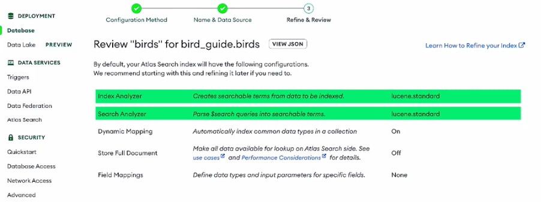
Se muestra información sobre los analizadores que se están utilizando, en la mayoría de los casos `lucene.standard`

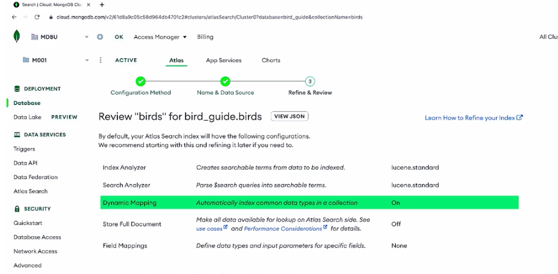
El tipo de correlación, ya sea dinámico o no.

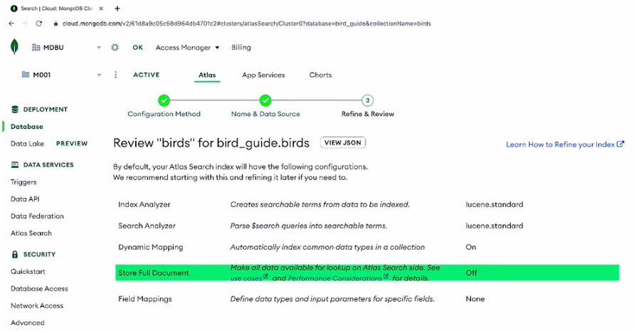
Opción para almacenar documetnos completos en memoria para un rendimiento posterior a la agregación.

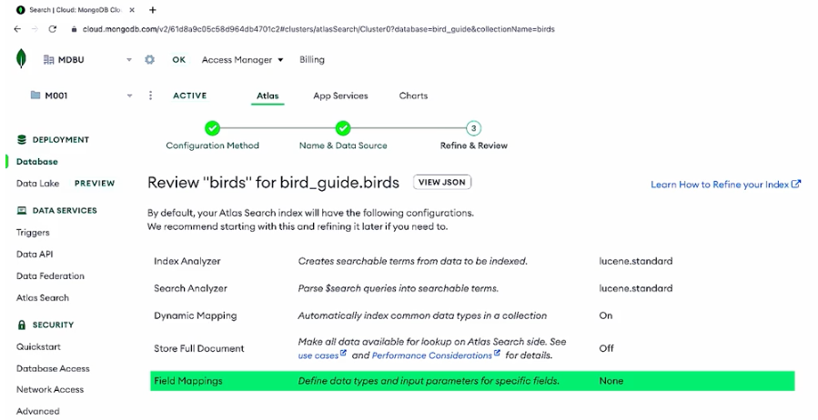
Y las correlaciones de campos.

## Quiz 1

**Which type of search is depicted in the image below? (Select one.)**

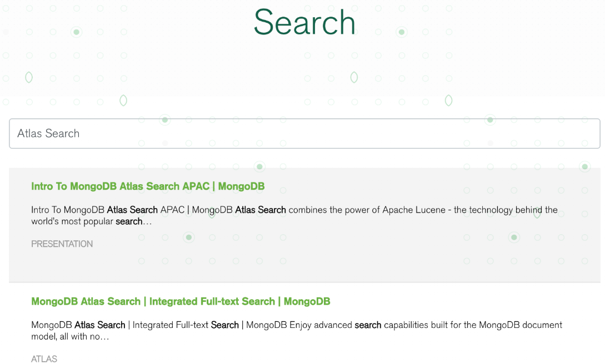

b. Relevance-based search in an application
Correct.

This is a relevance-based search on the MongoDB homepage, where the user searched for "Atlas Search" and the results 
returned were relevant to that search term.

## Quiz 2

**Which part of this search index is the analyzer?**

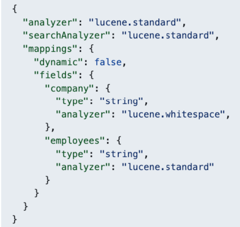

`lucene.standard`

**Which part of this search index is the field mapping?**

`mappings`

**Which part of this search index are the fields which are being mapped?**

`company` & `employees`

## Lesson 2: Creating a Search Index with Dynamic Mapping

### Create search index
- Search Index
  - Defines how a search should be performed
- Database Index
  - Makes database queries more efficient
- All fields indexed except (Booleans, ObjectIds and TimeStamps)

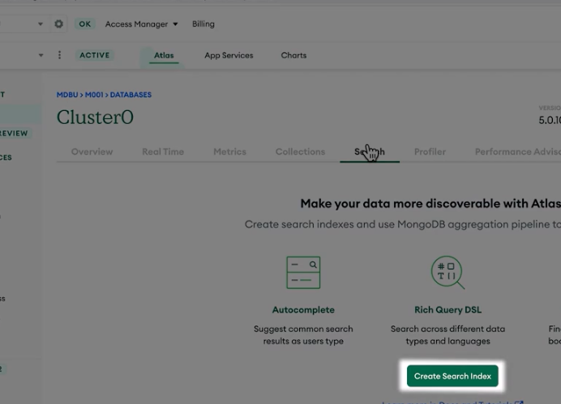
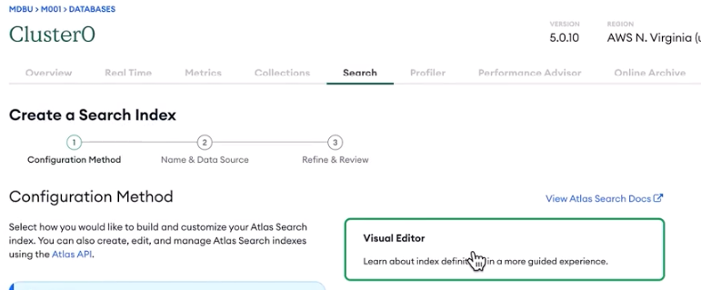
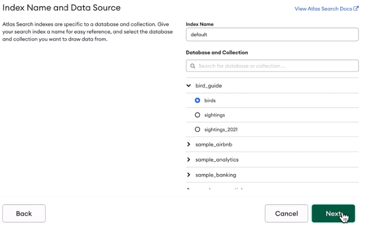

### Set option for dynamic mapping
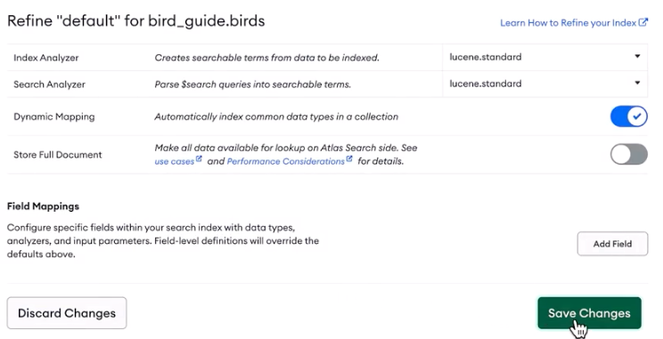
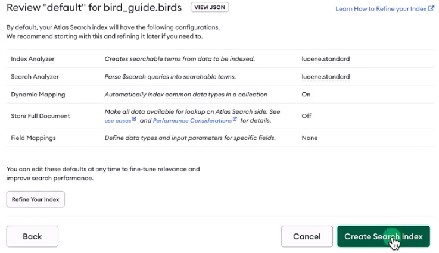

### Test with a query
Ahora se pueden ejecutar queries en la base de datos
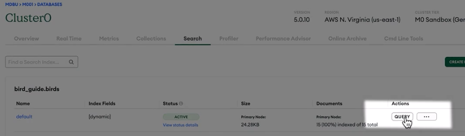

Para buscar todos las aves con plumas azules
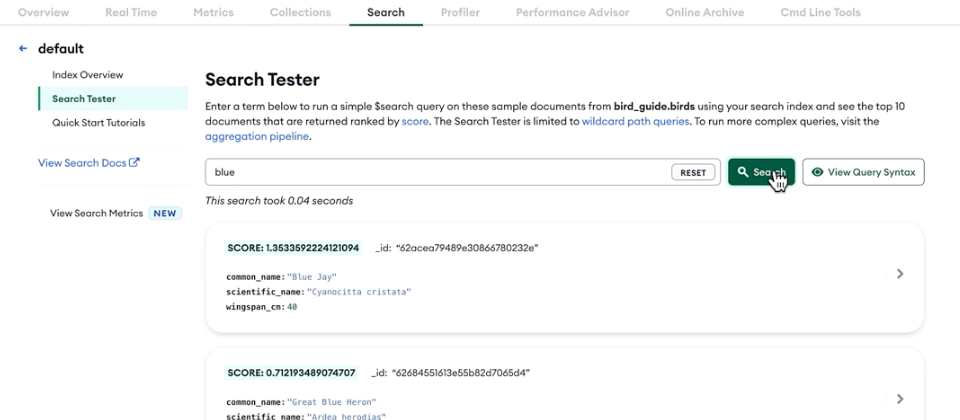


## Practice 1

### Lab Instructions

1. Open and edit the index definition file, /app/search_index.json, in the Code Editor tab to set the value of dynamic to true. After you edit the search_index.json file, it will be autosaved. You can also use the keyboard commands such as ⌘+S or Ctrl+S to save explicitly.

The final file should look like this:

```json lines
{
    "name": "sample_supplies-sales-dynamic",
    "searchAnalyzer": "lucene.standard",
    "analyzer": "lucene.standard",
    "collectionName": "sales",
    "database": "sample_supplies",
    "mappings": {
        "dynamic": true
    }
}
```
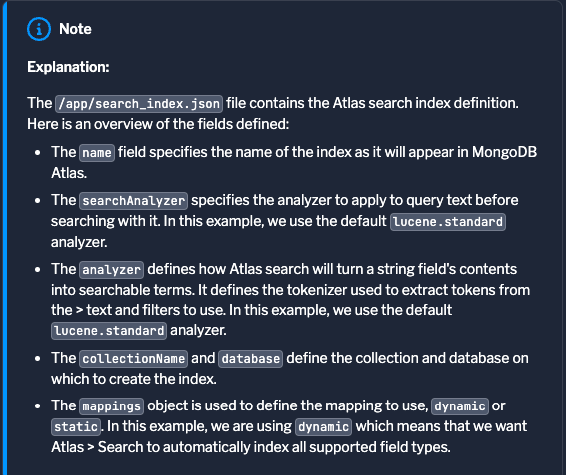
2. Navigate to the terminal tab at the top of the screen and run the following command to create the Atlas Search index:
```json lines
atlas clusters search indexes create --clusterName myAtlasClusterEDU -f /app/search_index.json
```

3. To verify that the index creation has started, please run the following command in the terminal:
```json lines
atlas clusters search indexes list --clusterName myAtlasClusterEDU --db sample_supplies --collection sales
```
If the index has been created (or is in the process of being created) you should see output similar to the following in your terminal, the ID field value will differ:

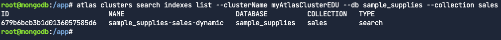

## Using an Atlas Search Index With Dynamic Mapping

In this lab, you learn to use the $search aggregation stage to perform search queries on the Atlas Search index you have recently created.

### Lab Instructions

1. In the `mongosh` tab, run the following `findOne()` command to obtain sample document.
```json lines
db.sales.findOne()
```
```json lines
{
  _id: ObjectId("5bd761dcae323e45a93cd037"),
  saleDate: ISODate("2017-03-18T14:43:24.028Z"),
  items: [
    {
      name: 'backpack',
      tags: [ 'school', 'travel', 'kids' ],
      price: Decimal128("105.7"),
      quantity: 5
    },
    ...
],
  storeLocation: 'London',
  customer: {
    gender: 'F',
    age: 29,
    email: 'jokakre@pocuuwe.kw',
    satisfaction: 4
  },
  couponUsed: false,
  purchaseMethod: 'In store'
}
```
In this lab, we'll query the `sales` collection with the search index to identify documents where one of the fields 
contains the string `notepad`.

2. In the `mongosh` tab, modify the `$search` in the pipeline variable below and run the aggregation pipeline. 
You need to set the `text.query` value to `notepad` and the `text.path.wildcard` to `*`.

`/app/aggretions.js`
```json lines
db = db.getSiblingDB("sample_supplies")

var pipeline = [
{
  "$search": {
    index: "sample_supplies-sales-dynamic",
    text: {
      query: "notepad", 
      path: { "wildcard": "*" }
    } } },
{
  "$set": {
    score: { 
      "$meta": "searchScore" }
    }
}
]

var result = db.sales.aggregate(pipeline)

print(result)
```

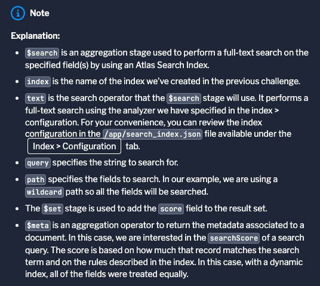

```json lines
load("/app/aggregation.js")
```
You should obtain a list of documents similar to the following:
```json lines
[
  {
    _id: ObjectId("5bd761ddae323e45a93cd937"),
    saleDate: ISODate("2013-05-05T19:03:06.358Z"),
    items: [
      {
        name: 'notepad',
        tags: [ 'office', 'writing', 'school' ],
        price: Decimal128("34.88"),
        quantity: 5
      },
      {
        name: 'notepad',
        tags: [ 'office', 'writing', 'school' ],
        price: Decimal128("7.95"),
        quantity: 5
      },
      {
        name: 'notepad',
        tags: [ 'office', 'writing', 'school' ],
        price: Decimal128("32.73"),
        quantity: 1
      }
    ],
    storeLocation: 'London',
    customer: { gender: 'M', age: 36, email: 'fo@zacge.ss', satisfaction: 5 },
    couponUsed: false,
    purchaseMethod: 'In store',
    score: 0.20185701549053192
  },
  ...
]
```

## Quiz 1
**When using a dynamic index, which fields does an Atlas Search query against? (Select one.)**

c. All of the fields including nested fields.

A search with a dynamic index will query against all of the fields, including nested fields.

## Quiz 2
**When would you use a dynamically mapped search index? (Select one.)**

c. When you want to search all of the fields with equal weight.
Dynamic field mapping is used to search all of the fields for the search term, with equal weight placed on all fields.

## Lesson 3: Creating a Search Index with Static Field Mapping

### Static Indexing

The field being queried are always the same

Static indexing on specific fields makes the search quick and efficient by minimizing the number of fields to be indexed.

Choose the field
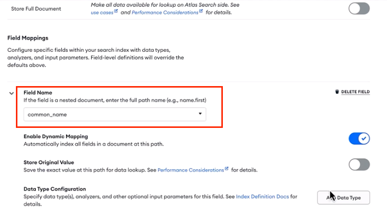

### Lab Instructions 1 - Creating a Search Index with Static Field Mapping

Lab Instructions
1. Open the search_index.json file in the editor tab by clicking the file name in the file explorer to the left.

2. Edit the JSON file in the IDE changing the value for the field 'type' for 'storeLocation' in 'fields' to string to reflect the sample below.

```json lines
{
  "name": "sample_supplies-sales-static",
  "searchAnalyzer": "lucene.standard",
  "analyzer": "lucene.standard",
  "collectionName": "sales",
  "database": "sample_supplies",
  "mappings": {
      "dynamic": false,
      "fields": {
          "storeLocation": {
              "type": "string"
          }
      }
  }
}
```

3. Then, navigate to the terminal tab at the top of the screen and run the following command: atlas clusters search indexes create:

```json lines
atlas clusters search indexes create --clusterName myAtlasClusterEDU -f /app/search_index.json
```

4. To verify that the index creation has started, please run the following command in the terminal.
```json lines
atlas clusters search indexes list --clusterName myAtlasClusterEDU --db sample_supplies --collection sales
```
If the index has been created you should see output similar to the following in your terminal, the ID field value will differ:
```json lines
ID                         NAME                           DATABASE          COLLECTION   TYPE
67c444d8408cbf1f427419dd   sample_supplies-sales-static   sample_supplies   sales        search
```

### Lab Instructions 2 - Using a Atlas Search Index With Static Mapping

In this lab, you will use the `mongosh` and the Aggregation Framework, specifically the `$search` stage to use your newly created Atlas Search index.

### Lab Instructions
You will be connected to your Atlas cluster and to the sample_supplies database. Use the sales collection in this lab.

1. Copy and paste the following command to use `mongosh` to connect to your Atlas cluster. For simplicity, we have included your connection string in the command by using the bash variable `MY_ATLAS_CONNECTION_STRING` and appended the correct database for this lab.
```json lines
mongosh -u myAtlasDBUser -p myatlas-001 $MY_ATLAS_CONNECTION_STRING/sample_supplies
```

2. Next, create an aggregation pipeline, which will contain two stages. (Forgot the method for aggregation? Check the hint below!)
```json lines
db.sales.aggregation([])
```

3. Create a `$search` stage that uses the index `sample_supplies-sales-static` with query value of `London` and a path wildcard of `*`.
```json lines
db.sales.aggregate([
  {
    $search: {
      index: 'sample_supplies-sales-static',
      text: {
        query: 'London', path: { 'wildcard': '*' }
      }
    }
  }
])
```

4. Create a `$set` stage that adds a new field `score` to the document to represent the Atlas Search score `{ $meta: "searchScore" }`.

```json lines
db.sales.aggregate([
  {
    $search: {
      index: 'sample_supplies-sales-static',
      text: {
        query: 'London', path: { 'wildcard': '*' }
      } } },
  {
    $set: {
      score: { $meta: "searchScore" }
      }
  }
])
```

5.  Review the documents outputted and note they now include a score, the `object_id`, and the fields that matched the search term. The score is based on how much that record matches the search term and on the rules described in the index. In this case, with a static mapping for the index, the field `storeLocation` is what is used for the score calculation.

## Quiz 1
**If the search index is statically mapped and the only field mapping is for the "storeLocation" field, and you searched for one of the items sold by the office supply company, notepads, how many results will come up? (Select one.)**
c.
None
Correct.

The only field indexed is the location of the store, so data such as the items sold have not been indexed by the search algorithm. Only queries for names of cities present as values in the storeLocation field will be returned.

## Quiz 2
The following code is a snippet from a search index. What type of field mapping does this search index use? (Select one.)

```json lines
{
    "mappings": {
        "dynamic": false,
        "fields": {
            "common_name": [
            {
                "dynamic": true,
                "type": "document"
            },
            {
                "type": "string"
            }
            ]
        }
    }
}
```
b.
Static Mapping
Correct!

This is a statically-mapped search index. As you can see within `fields` there are specific settings for the `common_name` field. 
Search indexes with static field mapping are designed to find results from specified fields.

## Lesson 4: Creating a $search and Compound Operators

Improve the search by assigning weights to different fields using the compound operator so that the most important results return first.

Create an aggregation pipeline with a $search stage and then we'll use the $compound operator to specify how the results should be ranked.

Compound operators
1. must
2. must not
3. should
4. filter

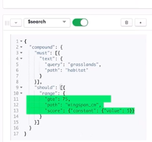
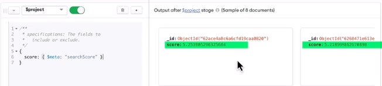

The compound operator within the `$search` aggregation stage allows us to give weight to different field and also filter 
our results without having to create additional aggregation stages. The four options for the compound operator are `must`, `mustNot`, `should`, and `filter`.

`must` will exclude records that do not meet the criteria. 
`mustNot` will exclude results that do meet the criteria. 
`should` will allow you to give weight to results that do meet the criteria so that they appear first. 
`filter` will remove results that do not meet the criteria.

```json lines
$search {
  "compound": {
    "must": [{
      "text": {
        "query": "field",
        "path": "habitat"
      }
    }],
    "should": [{
      "range": {
        "gte": 45,
        "path": "wingspan_cm",
        "score": {"constant": {"value": 5}}
      }
    }]
  }
}
```

## Lab 1 - Using a Atlas Search Index With Dynamic Mapping
Lab Instructions
You will be connected to your Atlas cluster and to the `sample_supplies` database. 
Use the `sales` collection in this lab.

1. Copy and paste the following command to use `mongosh` to connect to your Atlas cluster. 
For simplicity, we have included your connection string in the command by using the bash variable `MY_ATLAS_CONNECTION_STRING` 
and appended the correct database for this lab.

2. Next, create an aggregation pipeline, which will contain two stages. (Forgot the method for aggregation? Check the hint below!)

3. Create a `$search` stage that uses the index `sample_supplies-sales-dynamic` and compound operators in this stage.
  .- Firstly, create a compound operator in the search stage. The compound operator combines multiple search clauses to return the most relevant results and assigns weights to documents with qualities that you want to appear higher in search results. For this example, we are focusing ononline sales.
  .- Filter out any sales that did not take place online by using the `filter` clause to filter out any documents that do not have `Online` as the query value in the `purchaseMethod` field.
```json lines
"compound": {
  "filter": [
    {
      "text": {
        "query": "<VALUE>",
        "path": "purchaseMethod"
      }
    }
  ]
}
```
4. Next, add a `should` clause as the administrators would like to search online sales to see records of online orders where a particular item was included in the order.
  .- To implement this, the `items.name` field must have the highest weight of all the fields in the record. Let's use the `should` clause to indicate that the search term should appear in the `items.name` field.
  .- Give that field, score a constant value of 5.
  .- Review the outputted documents.
```json lines
"compound": {
    "filter": [
      {
        "text": {
          "query": "<VALUE>",
          "path": "purchaseMethod"
        }
      }
    ]
    "should": [
      {
        "text": {
          "query": "notepad",
          "path": "items.name",
          "score": {"constant": { "value": X } }
        }
      }
  ]
}
```
  .- The use of a constant score overwrites the calculated score search value to the define constant ('5') which can be 
  desirable when you only care about matches for a particular clause. In our example above we are only interested in 
  online purchases which include one or more notepads as part of the sale transaction.

5. The final stage of the pipeline will be a `$project` stage which adds a score field to represent how the document was scored using the Atlas Search index.
```json lines
$project: {
  "items.name": 1,
  "purchaseMethod": 1,
  "score": {$meta: "searchScore"}
}
```

```json lines
db.sales.aggregate([
  {
    $search: {
      index: 'sample_supplies-sales-dynamic',
      "compound": {
        "filter": [
          {
            "text": {
              "query": "Online",
              "path": "purchaseMethod"
            }
          }
        ],
        "should": [
          {
            "text": {
              "query": "notepad",
              "path": "items.name",
              "score": { "constant": { "value": 5 } }
            }
          }
        ]
      }
    }
  },
  {
    $project: {
      "items.name": 1,
      "purchaseMethod": 1,
      "score": { $meta: "searchScore" }
    }
  }
])
```

## Quiz 1
**What does the “filter” clause do? (Select one.)**

a.
It returns results that match the clause.
Correct.

The `filter` clause returns results that match the clause. It eliminates results that do not match the clause.

## Quiz 2
**Which clauses used by the compound operator contribute to the score given the results? (Select one.)**

d.
`must`, `must not`, and `should`
Correct.

`Must`, `must not`, and `should` are all clauses, but `filter` does not impact the score given to the results. 

## Group Search Results by Using Facets

### Facets -> Buckets that we group our search results into 

Types of data:
1. Numbers
2. Dates
3. Strings
 
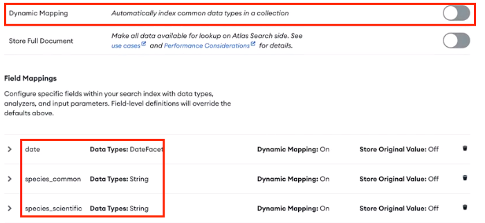

It will be used `$searchMeta` -> Allows us to see the facets and how many results are in each bucket.
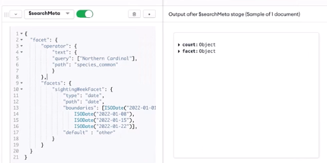

`$searchMeta` is an aggregation stage for Atlas Search where the metadata related to the search is shown. 
This means that if our search results are broken into buckets, using facet, we can see that in the `$searchMeta` stage, 
because those buckets are information about how the search results are formatted.

```json lines
$searchMeta: {
    "facet": {
        "operator": {
            "text": {
            "query": ["Northern Cardinal"],
            "path": "common_name"
            }
        },
        "facets": {
            "sightingWeekFacet": {
                "type": "date",
                "path": "sighting",
                "boundaries": [ISODate("2022-01-01"), 
                    ISODate("2022-01-08"),
                    ISODate("2022-01-15"),
                    ISODate("2022-01-22")],
                "default" : "other"
            }
        }
    }
}
```
`facet` is an operator within `$searchMeta`. `operator` refers to the search operator - the query itself. 
`facets` operator is where we put the definition of the buckets for the facets.

## Lab - Create a Atlas Search Index With Static Mapping

### Lab Instructions
1. Open the `search_index.json` file in the editor tab by clicking the file name in the file explorer to the left.
2. Edit the JSON file in the IDE as follows: changing the value for the second field 'type' for 'purchaseMethod' in 'fields' to string and change the second field 'type' for 'storeLocation' to stringFacet to reflect the sample below.
```json lines
{
  "name": "sample_supplies-sales-facets",
  "searchAnalyzer": "lucene.standard",
  "analyzer": "lucene.standard",
  "collectionName": "sales",
  "database": "sample_supplies",
  "mappings": {
    "dynamic": true,
    "fields": {
      "purchaseMethod": [
        {
          "dynamic": true,
          "type": "document"
        },
        {
          "type": "string"
        }
      ],
      "storeLocation": [
        {
          "dynamic": true,
          "type": "document"
        },
        {
          "type": "stringFacet"
        }
      ]
    }
  }
}
```
3. After you edit the `search_index.json` file, it will be autosaved. You can also use the keyboard commands such as ⌘+S or 
Ctrl+S to save explicitly. Then, navigate to the terminal tab at the top of the screen and run the following command: 
atlas clusters search indexes create: 
```json lines
atlas clusters search indexes create --clusterName myAtlasClusterEDU -f /app/search_index.json
```

4. To verify that the index creation has started, please run the following command in the terminal 
``` json lines
atlas clusters search indexes list --clusterName myAtlasClusterEDU --db sample_supplies --collection sales:
```
```json lines
ID                         NAME                           DATABASE          COLLECTION   TYPE
67c45a4beb1f885d9242e224   sample_supplies-sales-facets   sample_supplies   sales        search
```

## Lab 2 - Using a Atlas Search Index With Static Mappings and Facets

### Lab Instructions
You will be connected to your Atlas cluster and to the `sample_supplies` database. Use the `sales` collection in this lab.

1. Copy and paste the following command to use `mongosh` to connect to your Atlas cluster. For simplicity, 
we have included your connection string in the command by using the bash variable `MY_ATLAS_CONNECTION_STRING` 
and appended the correct database for this lab.
```json lines
mongosh -u myAtlasDBUser -p myatlas-001 $MY_ATLAS_CONNECTION_STRING/sample_supplies
```

2. Next, create an aggregation pipeline, which will contain a single stage. (Forgot the method for aggregation? Check the hint below!)

3. Create a `$searchMeta` stage that uses the index `sample_supplies-sales-facets` and compound operators in this stage. 
Firstly, add the `operator` field which defines the search query whose result set will be faceted over. 
In this example, we are searching for results with `In store` as the value in the `purchaseMethod` field.
  .- Create the `operator` field defines the search query.
  .- Next, complete the `operator` document. In this example, we are searching for results with `In store` as the value (query) where `purchaseMethod` is the value for the path field.
```json lines
"facet": {
    "operator": {
        "text": {
            "query": ["In store"],
            "path": "<VALUE>"
        }
    }
}
```
4. Next, add a `facets` field which creates a facet called `locationFacet` based on the string value in the `storeLocation` field in the collection. 
This `facets` field when combined with the `operator` field which defines the search query whose result set will be faceted over `$searchMeta` stage.
```json lines
    ...
    "facets": {
        "locationFacet": {
            "type": "string",
            "path": "<VALUE>",
        }
    }
```
5. Review the output in the `mongosh` and it should resemble the following, where the `sales` are bucked into store locations and the number of sales for that location:
```json lines
[
  {
    count: { lowerBound: Long("2819") },
    facet: {
      locationFacet: {
        buckets: [
          { _id: 'Denver', count: Long("864") },
          { _id: 'Seattle', count: Long("648") },
          { _id: 'London', count: Long("455") },
          { _id: 'Austin', count: Long("378") },
          { _id: 'New York', count: Long("289") },
          { _id: 'San Diego', count: Long("185") }
        ]
      }
    }
  }
]
```

```json lines
db.sales.aggregate([{
  $searchMeta: {
    index: 'sample_supplies-sales-facets',
    "facet": {
      "operator": {
        "text": {
          "query": "In store",
          "path": "purchaseMethod"
        }
      },
      "facets": {
        "locationFacet": {
          "type": "string",
          "path": "storeLocation"
        }
      },
    }
  }
}])
```

## Quiz 1

**If you want to view the metadata (facets and their count) for Atlas Search, which aggregation stage must you use? (Select one.)**
b.
$searchMeta
Correct.

To view the search metadata (facets and their count), use the $searchMeta stage.

## Quiz 2

**Which operator can you use to group Atlas search results? (Select one.)**

d.
facet
Correct.

To group your search results, use the facet operator.

## Conclusion

### MongoDB Atlas Search

Congratulations on learning about Atlas Search, an incredibly powerful tool for adding search functionality to your apps. 
In this unit, we covered the basics of Atlas Search, including the following:

  · What a search index is.
  · How to use a dynamically mapped search index to find results from any field in your data.
  · How to use a statically mapped search index to find results from the most relevant parts of your data.
  · How to use the aggregation pipeline to complete a $search operation.
  · How to use a compound operator to search based on multiple operators.
  · How to use a compound operator to give more weight to certain fields and give the user more relevant results.

How to use $searchMeta and $facet to categorize search results to help your app's users find what they need more quickly


