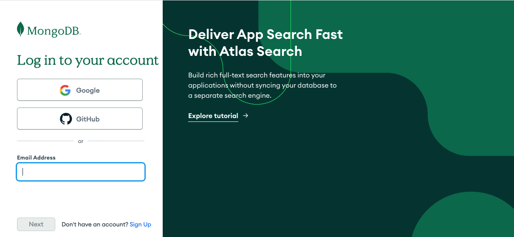
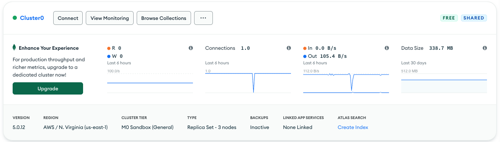

# MongoDB Atlas Search

## Lesson 1: Using Relevance-Based Search and Search Indexes

### Use cases for Atlas Search
- Atlas Search es una búsqueda basada en la relevancia que es cuando el usuario final de una app. busca registros de
de superficie basados en un término de búsqueda.
- No es una búsqueda de base de datos para un regitro en particular.
- Es una búsqueda contextual sobre documentos.
- Usan Apache Lucene directamente en MongoDB Atlas.


### Relevance-Based Search vs. Database Search
- Búsqueda por relevancia de información
- Búsqueda en la base de datos.

### Search Index vs. Database Index
- Search Index no es lo mismo que el Database Index
- Database Index es el usado en las colecciones de la base de datos
- Search Index se utiliza para especificar cómo debe se hace referencia a los registros para la búsqueda basada en relevancia.

### Components of a Search Index


Se muestra información sobre los analizadores que se están utilizando, en la mayoría de los casos `lucene.standard`


El tipo de correlación, ya sea dinámico o no.


Opción para almacenar documetnos completos en memoria para un rendimiento posterior a la agregación.


Y las correlaciones de campos.

## Quiz 1

**Which type of search is depicted in the image below? (Select one.)**


b. Relevance-based search in an application
Correct.

This is a relevance-based search on the MongoDB homepage, where the user searched for "Atlas Search" and the results 
returned were relevant to that search term.

## Quiz 2

**Which part of this search index is the analyzer?**


`lucene.standard`

**Which part of this search index is the field mapping?**

`mappings`

**Which part of this search index are the fields which are being mapped?**

`company` & `employees`

## Lesson 2: Creating a Search Index with Dynamic Mapping

### Create search index
- Search Index
  - Defines how a search should be performed
- Database Index
  - Makes database queries more efficient
- All fields indexed except (Booleans, ObjectIds and TimeStamps)


### Set option for dynamic mapping


### Test with a query
Ahora se pueden ejecutar queries en la base de datos


Para buscar todos las aves con plumas azules


## Practice 1

### Lab Instructions

1. Open and edit the index definition file, /app/search_index.json, in the Code Editor tab to set the value of dynamic to true. After you edit the search_index.json file, it will be autosaved. You can also use the keyboard commands such as ⌘+S or Ctrl+S to save explicitly.

The final file should look like this:

```json lines
{
    "name": "sample_supplies-sales-dynamic",
    "searchAnalyzer": "lucene.standard",
    "analyzer": "lucene.standard",
    "collectionName": "sales",
    "database": "sample_supplies",
    "mappings": {
        "dynamic": true
    }
}
```

2. Navigate to the terminal tab at the top of the screen and run the following command to create the Atlas Search index:
```json lines
atlas clusters search indexes create --clusterName myAtlasClusterEDU -f /app/search_index.json
```

3. To verify that the index creation has started, please run the following command in the terminal:
```json lines
atlas clusters search indexes list --clusterName myAtlasClusterEDU --db sample_supplies --collection sales
```
If the index has been created (or is in the process of being created) you should see output similar to the following in your terminal, the ID field value will differ:


## Using a Atlas Search Index With Dynamic Mapping

In this lab, you learn to use the $search aggregation stage to perform search queries on the Atlas Search index you have recently created.

### Lab Instructions

1. In the `mongosh` tab, run the following `findOne()` command to obtain sample document.
```json lines
db.sales.findOne()
```
```json lines
{
  _id: ObjectId("5bd761dcae323e45a93cd037"),
  saleDate: ISODate("2017-03-18T14:43:24.028Z"),
  items: [
    {
      name: 'backpack',
      tags: [ 'school', 'travel', 'kids' ],
      price: Decimal128("105.7"),
      quantity: 5
    },
    ...
],
  storeLocation: 'London',
  customer: {
    gender: 'F',
    age: 29,
    email: 'jokakre@pocuuwe.kw',
    satisfaction: 4
  },
  couponUsed: false,
  purchaseMethod: 'In store'
}
```
In this lab, we'll query the `sales` collection with the search index to identify documents where one of the fields 
contains the string `notepad`.

2. In the `mongosh` tab, modify the `$search` in the pipeline variable below and run the aggregation pipeline. 
You need to set the `text.query` value to `notepad` and the `text.path.wildcard` to `*`.

`/app/aggretions.js`
```json lines
db = db.getSiblingDB("sample_supplies")

var pipeline = [
{
  "$search": {
    index: "sample_supplies-sales-dynamic",
    text: {
      query: "notepad", 
      path: { "wildcard": "*" }
    } } },
{
  "$set": {
    score: { 
      "$meta": "searchScore" }
    }
}
]

var result = db.sales.aggregate(pipeline)

print(result)
```


```json lines
load("/app/aggregation.js")
```
You should obtain a list of documents similar to the following:
```json lines
[
  {
    _id: ObjectId("5bd761ddae323e45a93cd937"),
    saleDate: ISODate("2013-05-05T19:03:06.358Z"),
    items: [
      {
        name: 'notepad',
        tags: [ 'office', 'writing', 'school' ],
        price: Decimal128("34.88"),
        quantity: 5
      },
      {
        name: 'notepad',
        tags: [ 'office', 'writing', 'school' ],
        price: Decimal128("7.95"),
        quantity: 5
      },
      {
        name: 'notepad',
        tags: [ 'office', 'writing', 'school' ],
        price: Decimal128("32.73"),
        quantity: 1
      }
    ],
    storeLocation: 'London',
    customer: { gender: 'M', age: 36, email: 'fo@zacge.ss', satisfaction: 5 },
    couponUsed: false,
    purchaseMethod: 'In store',
    score: 0.20185701549053192
  },
  ...
]
```

## Quiz 1
**When using a dynamic index, which fields does an Atlas Search query against? (Select one.)**

c. All of the fields including nested fields.

A search with a dynamic index will query against all of the fields, including nested fields.

## Quiz 2
**When would you use a dynamically mapped search index? (Select one.)**

c. When you want to search all of the fields with equal weight.
Dynamic field mapping is used to search all of the fields for the search term, with equal weight placed on all fields.

## Lesson 3: Creating a Search Index with Static Field Mapping


