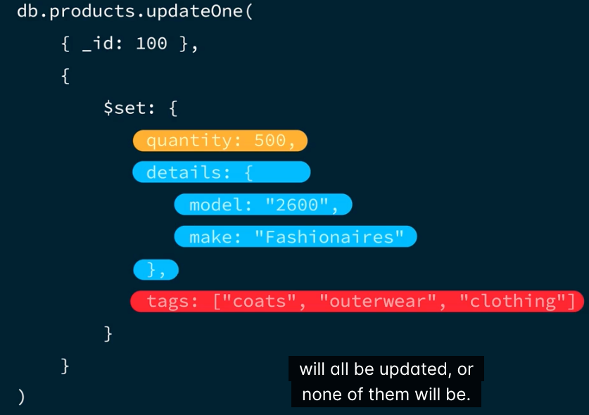

# Lesson 1: Introduction to ACID Transactions

## ACID Transactions
A group of database operations that will be completed as a unit or not at all, ensuring database safety and consistency

ACID Acronym
* Atomicity -> All operations will either succeed or fail together.
* Consistency -> All changes made by operations are consistent with database constraints.
* Isolation -> Multiple transactions can happen at the same time without affecting the outcome of the other transaction.
* Durability -> All the changes that are made by operations in a transaction will persist, no matter what.

ACID Transactions should be used in scenarios that involve the transfer of value from one record to another.

## Quiz 1
**Which of the following is the best definition of an ACID transaction? (Select one.)**

A group of database operations that must happen all together or not at all.

An ACID transaction involves a group of database operations that must happen together successfully or not at all.

## Quiz 2
**Which of the following scenarios require the use of an ACID transaction? (Select all that apply.)**

Updating a bank database to reflect the transfer of money from Customer A's bank account into Customer B's bank account.
In the case of a bank account transfer, the database operations MUST happen atomically. This scenario requires the use of ACID properties to guarantee that all operations happen successfully and securely, or that they don't happen at all.

Updating inventory and shopping cart records when a customer adds an item to their online shopping cart in an ecommerce app.
In most scenarios involving the transfer of value, inventory, or ownership of goods, database operations MUST happen atomically. This scenario requires the use of ACID properties to guarantee that both the inventory and shopping cart records are updated together or not at all.


# Lesson 2: ACID Transactions in MongoDB

## Single and Multi-document ACID Transactions in MongoDB

* Due to the nature of the document model, database operations that only affect one document are inherently atomic in MongoDB.

* `updateOne()` operations update only one document, is technically an ACID transaction.



## When to use a Multi-document transaction in MongoDB

* Multi-document Operations are not inherently atomic.
* Require extra steps to have ACID transaction.
* MongoDB "locks" resources involved in a transaction.
* Incurs performance cost and affects latency.
* Use multi-document transactions as a precise tool.

## Quiz 1

**Which of the following statements are true about multi-document transactions in MongoDB? (Select all that apply.)**

Database operations that affect more than one document, like .updateMany(), are not inherently atomic in MongoDB and must be completed by using a multi-document transaction in order to have ACID properties.
A multi-document must be used to ensure that database operations that affect more than one document in a MongoDB database have ACID properties.

Multi-document transactions should be treated as a precise tool that is used only in certain scenarios.
Multi-document transactions can incur a performance cost. It's important to follow best practices and use multi-document transactions only when ACID properties are essential.

Using a multi-document transaction with a MongoDB database ensures that the database will be in a consistent state after running a set of operations on multiple documents.
Using a multi-document transaction guarantees that operations have ACID properties and, therefore, that the database will be in a consistent state once the transaction is complete.

## Quiz 2

**Nadia needs to update customer account balances across multiple collections in MongoDB. It's important that the database operations used in this transaction adhere to ACID properties. Should Nadia use a transaction in this scenario? (Select one.)**

Nadia does need to use a transaction in this scenario because multi-document operations are NOT inherently atomic in MongoDB.
Nadia should use a multi-document transaction in this scenario. Unlike single-document operations, multi-document operations are not inherently atomic in MongoDB. Because the group of database operations will be performed on multiple documents and require ACID properties, they should use a multi-document transaction.

# Lesson 3: Using Transactions in MongoDB

## Use a multi-document transaction with a session in the shell
Given this account


and this account


* Session -> used to group database operations that are related to each other and should be run together.
* A transaction has a maximum runtime of less than one minute after the first write.
* MongoServerError: Transaction 1 has been aborted.

Create a session and a transaction:


Create a variable to the account collection:


The first operation:


Update the other account:


Commit the transaction:


Verify the transaction:


## Abort a multi-document transaction in the shell

If we decide to abort the transaction we can use `.abortTransaction()` command.

## Transfer money between two accounts


## Practice 1

## Creating a Multi-Document Transaction

In this lab, you will use a multi-document transaction to insert a new savings account into the `accounts` collection 
for an existing customer and fund it with $100 from their checking account.

A transaction has a maximum runtime of less than one minute. In other words, once you enter your first write operation, you have only 60 seconds to complete the transaction. Commands are provided for you in this exercise to assist with meeting this deadline in the shell.

## Lab Instructions
* You’re connected to an Atlas cluster.
* You’re connected to the `bank` database and you’ll use the `accounts` collection.
1. Open a new session by creating a `session` variable that will store the session object with the following command:
```json lines
const session = db.getMongo().startSession()
```
2. Start a transaction on the newly created `session` variable with the following command:
```json lines
session.startTransaction()
```
3. Create an `account` variable to reference the accounts collection with the following command:
```json lines
const account = session.getDatabase('bank').getCollection('accounts')
```
4. Insert a new account for `account_holder` "Florence Taylor" with an `account_id` of "MDB454252264", an `account_type` 
of "savings", a `balance` of 100.00, and an empty `transfers_complete` array. You can do this with the following command:
```json lines
account.insertOne({
  account_id: "MDB454252264",
  account_holder: "Florence Taylor",
  account_type: "savings",
  balance: 100.0,
  transfers_complete: [],
  last_updated: new Date()
})
```
5. Fund the account with 100.00 from a checking account with an `account_id` of "MDB963134500" that belongs to the same 
account holder. You can do this with the following command:
```json lines
account.updateOne( { account_id: "MDB963134500" }, {$inc: { balance: -100.00 }})
```
6. Complete the transaction on the session using the following command:
```json lines
session.commitTransaction()
```

## Practice 2

## Abort a Multi-Document Transaction

In this activity, we will create a multi-document transaction that adds 100 to the balance field of the following account:
```json lines
{
    "_id":{
        "$oid":"62a3638521a9ad028fdf77a5"
        },
    "account_id":"MDB740836066",
    "account_holder":"Naja Petersen",
    "account_type":"savings",
    "balance": 2891.8,
    "transfers_complete":[
        "TR784553031",
        "TR728134708",
        "TR396066257"
        ]
    }
```
Then we will deduct 5 from the balance field of the following account:
```json lines
{
    "_id":{
        "$oid":"62a3638521a9ad028fdf77b0"
        },
    "account_id":"MDB963134500",
    "account_holder":"Florence Taylor",
    "account_type":"checking",
    "balance": 2598.57,
    "transfers_complete":[
       "TR652631048",
       "TR846259280",
       "TR412957052",
       "TR519499915",
       "TR767971921",
       "TR717427175",
       "TR263422717"
        ]
    }
```
We will abort the transaction before it is committed to roll back the change in the account balances.

A transaction has a maximum runtime of less than one minute. In other words, once you start a transaction, you have only 
60 seconds to complete it. Commands are provided for you in this exercise to assist with meeting this deadline in the shell.

## Lab Instructions
* You’re connected to an Atlas cluster.
* You’re connected to the `bank` database and you’ll use the `accounts` collection.
1. Open a new session by creating a `session` variable that will store the session object with the following command:
```json lines
session = db.getMongo().startSession();
```
2. Start a transaction on the newly created session variable with the following command:
```json lines
session.startTransaction();
```
3. Create an `account` variable to reference the `accounts` collection with the following command:
```json lines
const account = session.getDatabase('bank').getCollection('accounts')
```
4. Add 100 to the `balance` field of an account with a `account_id` of "MDB740836066". You can do this with the following command:
```json lines
account.updateOne( { account_id: "MDB740836066" }, {$inc: { balance: 100 }})
```
5. Decrease the account `balance` field of an account with a `account_id` of "MDB963134500" by 5. You can do this with the following command:
```json lines
account.updateOne( { account_id: "MDB963134500" }, {$inc: { balance: -5 }})
```
6. Abort the transaction with the following command:
```json lines
session.abortTransaction()
```
## Quiz 1

**You are creating a transaction that does the following:**

* **Inserts a new savings account into the accounts collection for an existing customer**

* **Funds the new savings account with $200 from their checking account**

**The transaction looks like this:**
```json lines
const session = db.getMongo().startSession()

session.startTransaction()

const account = session.getDatabase('bank').getCollection('accounts')

account.insertOne({
  account_id: "MDB361428849",
  account_holder: "Donna Wood",
  account_type: "savings",
  balance: 200.0,
  transfers_complete: [],
  last_updated: new Date()
})
account.updateOne( { account_id: "MDB919841472" }, {$inc: { balance: -200.00 }})
```
**What method should you use to complete this transaction? (Select one.)**

commitTransaction()
We use `.commitTransaction()` to commit a transaction `session.commitTransaction()` should be placed at the end of the transaction.

## Quiz 2

**Which of the following commands will output to the shell if they are successful?**

`.commitTransaction()`
If it's successful, `.commitTransaction()` will output a message to the shell that resembles the following:

```json lines
{
  ok: 1,
  '$clusterTime': {
    clusterTime: Timestamp({ t: 1647437775, i: 5 }),
    signature: {
      hash: Binary(Buffer.from("b0d88d5a96372efb9af22021cdd59021741ddb5c", "hex"), 0),
      keyId: Long("7019511514256113665")
    }
  },
  operationTime: Timestamp({ t: 1647437775, i: 5 })
}
```

