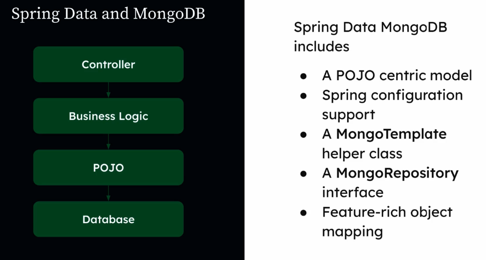
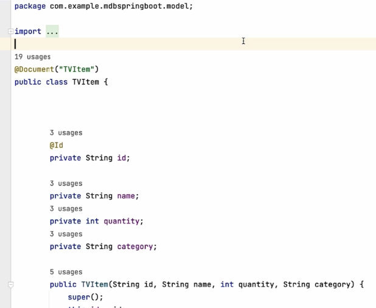
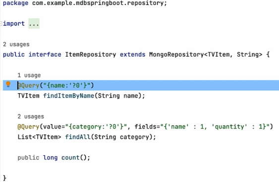
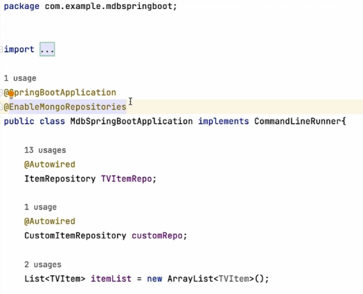

# Spring Data and MongoDB

## Learning Byte

* Here is an example of a model class

* Defining a repository

* To enable the Mongo Repositories

## Quiz 1

**Which of the following is true about how Spring Data works with MongoDB? Select one.**

d. Spring Data can map Java objects to MongoDB documents.

## Quiz 2
**What is the function of the MongoRepository interface in Spring Data? Select one.**

It allows users to perform basic queries (like CRUD operations) on a MongoDB database.