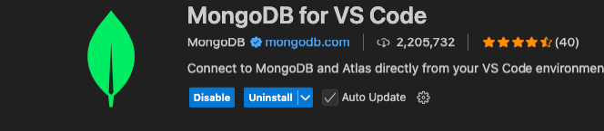

# MongoDB vs Code Extension

## Learning Byte

* Install this extension in VSC



* Create a playground with this

```json lines
const database = 'inventory'
const collection = 'products'

use(database);

db.products.drop();

db.createCollection(collection);

const products = [
{name: "Smartphone", price:499.99, category: "Electronics", inStock: true},
{name: "Laptop", price:899.99, category: "Electronics", inStock: false},
{name: "Running shoes", price:89.99, category: "Sports", inStock: true}
]

db.products.insertMany(products);

console.log(`${database}.${collection} has ${db.products.countDocuments()} documents.`);

db.products.find({inStock: true});

use("inventory");

db.products.createIndex({inStock: 1});

db.products.find({inStock: true}).explain();
```

* Create an aggregation pipeline

```json lines
db.products.aggregate([
    {
        $match: {
          inStock: true
        }
    },
    {
        $group: {
          _id: "$category",
          numProducts: {
            $sum: 1
          }
        }
    }
]);
```

## Quiz 1

**What does the schema tab allow us to do? (Select all that apply.)**
A. View the structure of documents
You can expand the schema tab to view the structure of your documents.

B. View the data types of fields with a consistent data type
You can expand the schema tab to view the data types of fields with a consistent data type.

## Quiz 2

**If you want to run a portion of the code in your playground file, what should you do? (Select one.)**

Highlight the block of code you want to run and press play
You can run a block of code by highlighting the code and pressing the play button in your playground.

