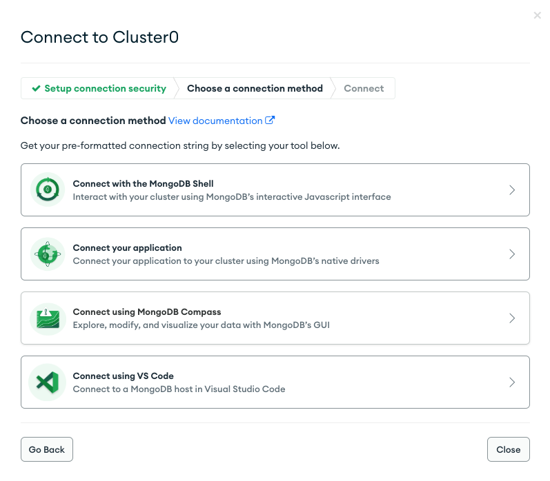

# Connecting to MongoDB in Java

## Using MongoDB Java Client Libraries

* MongoDB Java applications must use the official drivers

* Simplify connecting and interacting
* Establish secure connections to a MongoDB cluster
* Execute database operations on behalf of client applications
* Specify connection options

Official MongoDB drivers:
* Adhere to language best practices
* Use the full functionality of MongoDB deployment
* Make upgrading easier

## Quiz 1
**What is the principal responsibility of a MongoDB driver? (Select one.)**
To establish secure connections to a MongoDB cluster and execute database operations on behalf of client applications.
MongoDB drivers establish secure connections to a MongoDB cluster and execute database operations on behalf of client applications.

## Quiz 2
**The official MongoDB drivers adhere to each programming language’s best practices.**
True
The official MongoDB drivers adhere to each programming language’s best practices.

## Connecting to an Atlas Cluster in Java Applications

### Install the MongoDB Java Driver

1. Locate your `pom.xml` file
2. In the file, insert the code for the dependency:
```json lines
<dependencies>
    <dependency>
        <groupId>org.mongodb</groupId>
        <artifactId>mongodb-driver-sync</artifactId>
        <version>4.7.1</version>
    </dependency>
</dependencies>
```
Note that we'll use the synchronous Java driver. Confirm that you're installing the latest version

### Obtain Your MongoDB Connection String

1. Go to https://account.mongodb.com/account/login and log in to Atlas. The login page looks like the following: Once 
you're logged in, you will be taken to the Atlas dashboard for your current project. Click the Connect button.


2. Once you're logged in, you will be taken to the Atlas dashboard for your current project. Click the Connect button


3. This window displays your connection options. Click the "Connect your application" button.



4. This window contains the instructions for connecting your application. Click the copy icon to copy the connection string.


**Now you can use your connection string to connect to your Atlas cluster!**

### Connect to Your Atlas Cluster

1. Create a new file called `Connection.java` with the following code. This file uses your MongoDB connection string and the MongoClient to establish a connection with your Atlas cluster:

```json lines
package com.mongodb.quickstart;

import com.mongodb.client.MongoClient;
import com.mongodb.client.MongoClients;
import org.bson.Document;

import java.util.ArrayList;
import java.util.List;

public class Connection {

    public static void main(String[] args) {
        String connectionString = System.getProperty("mongodb.uri");
        try (MongoClient mongoClient = MongoClients.create(connectionString)) {
            List<Document> databases = mongoClient.listDatabases().into(new ArrayList<>());
            databases.forEach(db -> System.out.println(db.toJson()));
        }
    }
}
```

2. In the project's root folder, run the following command to compile your Maven project and connect to your Atlas cluster:

```json lines
mvn compile exec:java -Dexec.mainClass="com.mongodb.quickstart.Connection" -Dmongodb.uri="<connectionString>"mvn compile exec:java -Dexec.mainClass="com.mongodb.quickstart.Connection" -Dmongodb.uri="<connectionString>"
```

## Quiz 1
**How do you connect your Java application to your Atlas cluster? (Select one.)**

Create a MongoClient object from a connection string.
You create a MongoClient object from a connection string. For example:
```json lines
MongoClient client = MongoClients.create("mongodb+srv://...")
```

## Quiz 2
**According to the documentation, what are two build systems that can be used to add the MongoDB Java driver as a dependency in your Java application? (Select all that apply.)**

Maven
You can use Maven to add the MongoDB Java driver as a dependency in your Java application.

Gradle
You can use Gradle to add the MongoDB Java driver as a dependency in your Java application.

## Quiz 3
**How many MongoClient instances should your application have for a single Atlas cluster? (Select one.)**

1
You should have only one MongoClient instance per Atlas cluster for your application. If you use more than one MongoClient instance for a single Atlas cluster in your application, you risk having higher-than-normal database costs.

## Troubleshooting a MongoDB Connection in Java Applications

### MongoDB Network Access

1. Go to https://account.mongodb.com/account/login and log in into Atlas. The login page should look like the following:


2. Once you're logged in, you should be taken to the Atlas dashboard for your current project. Click "Network Access."


3. Click the “Add IP Address” button.


4. In the "Add IP Access List Entry" window, select "Add Current IP Address," and then click the Confirm button.


## Quiz 1

**What are the potential causes of the following error in a Java application? (Select all that apply.**
```json lines
Command failed with error 8000 (AtlasError): 'bad auth : Authentication failed.' on server cluster0-shard-00-02.zuxlr.mongodb.net:27017. 
The full response is {"ok": 0, "errmsg": "bad auth : Authentication failed.", "code": 8000, "codeName": "AtlasError"}
```


The database user is missing
Trying to connect to a cluster that's missing the specified database user will result in an authentication error. To fix this issue, add the correct database user with necessary privileges.

The username and/or password in the connection string is incorrect or misspelled
Misspelled login credentials will result in an authentication error. To address this issue, check your username and password in the connection string and correct them.

## Quiz 2

**What can cause the following error in a Java application? (Select one.)**
```json lines
An exception occured while executing the Java class. Timed out after 30000 ms while waiting for a server that matches 
com.mongodb.client.internal.MongoClientDelegate$1@41599ac0. Client view of cluster state is {type=REPLICA_SET, servers=[{address=cluster0-shard-00-00.zuxlr.mongodb.net:27017, type=UNKNOWN, state=CONNECTING, exception={com.mongodb.MongoSocketReadException: Prematurely, reached end of stream}}, {address=cluster0-shard-00-01.zuxlr.mongodb.net:27017, type=UNKNOWN, state=CONNECTING, exception={com.mongodb.MongoSocketReadException: Prematurely reached end of stream}}, {address=cluster0-shard-00-02.zuxlr.mongodb.net:27017, type=UNKNOWN, state=CONNECTING, exception={com.mongodb.MongoSocketReadException: Prematurely reached end of stream}}]
```

The user's current IP address is not on their IP access list in Atlas.
This is one of many causes of connection errors. You must add your host IP's address to the IP access list for your database deployment's project. The IP access list is found in the Network Access panel in Atlas. Atlas allows client connections only from IP addresses and CIDR address ranges in the IP access list.
